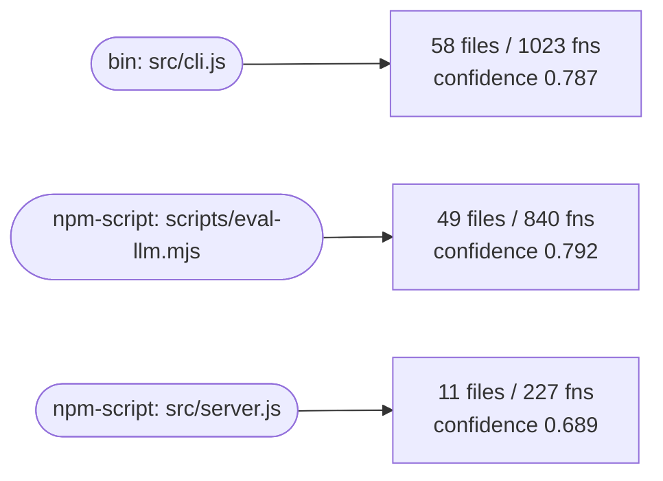
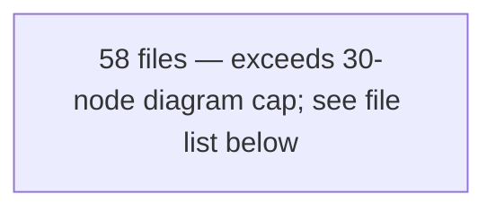
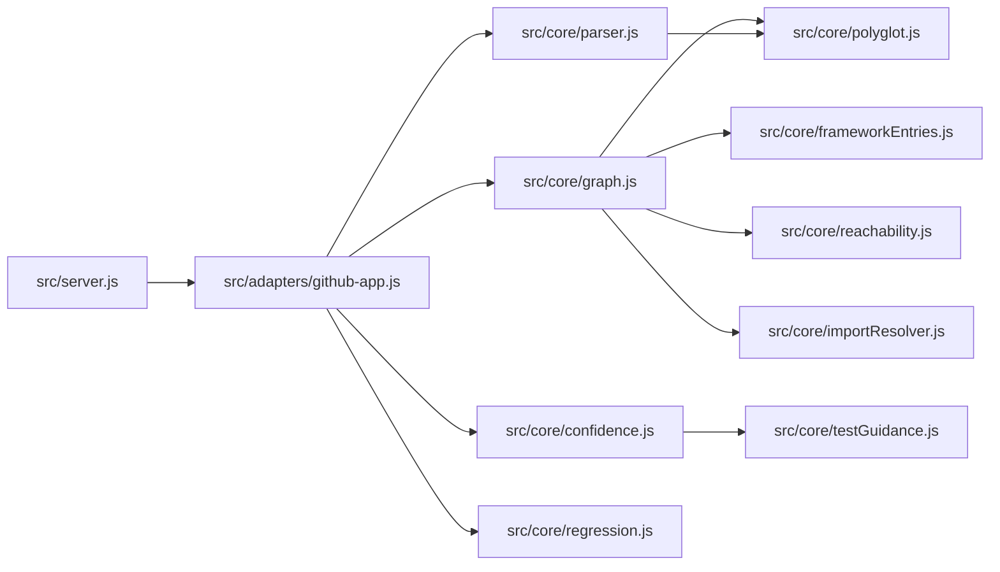

# Project Map

> Generated by Map'd on 2026-07-16T03:00:23.912Z — every number below is derived from AST analysis, not estimated.

**Repo confidence: 0.78** (size-weighted composite across workflows)

| Metric | Value |
|---|---|
| Files mapped | 131 (19,137 LOC) |
| Parsed cleanly | 131 |
| Parsed with recovery | 0 |
| Unparsed | 0 |
| Unsupported-language files | 0 |
| Import resolution rate | 100.0% |
| Call resolution rate | 91.4% (4401/4817) |

## Topology

## Workflows (3)

### `wf:bin:src/cli.js`

- **Entry:** `src/cli.js` (bin: mapd)
- **Scope:** 58 files, 1023 functions
- **Confidence:** `████████░░` **0.787** (signal coverage 0.9)

| Signal | Value | Weight |
|---|---|---|
| parseIntegrity | 1 | 0.3 |
| resolutionRate | 0.914 | 0.25 |
| testPresence | 0.534 | 0.25 |
| stability | unavailable | 0.1 |
| coverageOfRepo | 0.466 | 0.1 |

**Files:** `src/agents/anthropicClient.js`, `src/agents/llm.js`, `src/agents/provider.js`, `src/chat/commandRunner.js`, `src/chat/commands.js`, `src/chat/intent.js`, `src/chat/llmIntent.js`, `src/chat/repl.js`, `src/cli.js`, `src/config/index.js`, `src/config/schema.js`, `src/core/audit.js`, `src/core/changes.js`, `src/core/confidence.js`, `src/core/configLint.js`, `src/core/diagnose.js`, `src/core/docs.js`, `src/core/doctor.js`, `src/core/envFiles.js`, `src/core/events.js`, `src/core/evidence.js`, `src/core/findingScoring.js`, `src/core/fix.js`, `src/core/fixApply.js`, `src/core/frameworkEntries.js`, `src/core/gates.js`, `src/core/graph.js`, `src/core/grounding.js`, `src/core/handoff.js`, `src/core/importResolver.js`, `src/core/improve.js`, `src/core/integrate.js`, `src/core/intelligence.js`, `src/core/modernize.js`, `src/core/parseCache.js`, `src/core/parser.js`, `src/core/policy.js`, `src/core/polyglot.js`, `src/core/reachability.js`, `src/core/regression.js`, `src/core/resolution.js`, `src/core/retry.js`, `src/core/review.js`, `src/core/score.js`, `src/core/security.js`, `src/core/session.js`, `src/core/solutions.js`, `src/core/staleness.js`, `src/core/testGuidance.js`, `src/core/theme.js`, `src/core/trace.js`, `src/core/verify.js`, `src/core/view.js`, `src/core/viewServer.js`, `src/core/watch.js`, `src/core/workspace.js`, `src/mcp/server.js`, `src/mcp/tools.js`

**Exported surface:** `ANNOTATION_CLASSIFICATIONS`, `BASELINE_SCHEMA`, `CLASS`, `DEFAULTS`, `DEFAULT_IGNORE`, `DEPENDENCY_MUTATION`, `DESTRUCTIVE`, `G1`, `G2`, `G3`, `G4`, `GATES`, `GIT_MUTATION`, `KNOWN_UNSUPPORTED_EXTENSIONS`, `LEGACY_DEPS`, `NETWORKED`, `POLYGLOT_EXTENSIONS`, `PROJECT_MUTATION`, `PROTECTED_PATHS`, `READ_ONLY`, `READ_ONLY_COMMANDS`, `RECOGNIZED_ENV_KEYS`, `SRC_EXT_RE`, `TEST_PATH_RE`, `VERIFICATION`, `analyzeResolution`, `analyzeTestCoverage`, `answerReadOnly`, `anthropicProvider`, `applyAnnotations`, `applyPatchInWorkspace`, `applyProposals`, `applyRealTreeWrite`, `approveFixWithPostApplyVerification`, `babel-eslint`, `baselinePath`, `blue`, `bluebird`, `body-parser`, `bold`, `buildContextBudget`, `buildDiagnosis`, `buildFindingEvidence`, `buildGraph`, `buildGroundingFileList`, `buildHandoff`, `buildRescanEvent`, `buildRetryFeedback`, `buildScoredGraph`, `buildSolutions`, `buildTaskContext`, `buildViewModel`, `candidateFilesForFinding`, `ceilingScore`, `checkEnvFiles`, `checkReportFreshness`, `chooseFixTarget`, `classifyCommand`, `classifyIntent`, `classifyIntentWithProvider`, `classifyTestCredit`, `classifyUncoveredFiles`, `collectTopFindings`, `comparePostApplyHealth`, `confidenceColor`, `createAnthropicClientLoader`, `createChatContext`, `createCommandTable`, `createImportResolver`, `createIsolatedWorkspace`, `createMcpServer`, `createPolyglotResolver`, `createSessionId`, `createSessionState`, `createToolHandlers`, `createWatchBus`, `cyan`, `deepMerge`, `deltaScore`, `detectBundlerOutputs`, `detectCircularDependencies`, `detectConfigBundlerOutputs`, `detectConflicts`, `detectDynamicDirectoryReferences`, `detectDynamicImportPrefixes`, `detectElectronPreloadEntries`, `detectFrameworkEntries`, `detectGeneratedFiles`, `detectHtmlEntries`, `detectImportMetaGlobs`, `detectNextJsEntries`, `detectPackageManager`, `detectStack`, `detectTestGlobDirectories`, `detectToolingConfigEntries`, `detectViteEntries`, `detectWorkerUrls`, `diffGraphs`, `diffWorkspace`, `dim`, `emitRescanEvent`, `explainScore`, `exportTranscriptMarkdown`, `fenceUntrustedContent`, `filesOf`, `findFileNode`, `gatherRelevantSources`, `getActiveChildren`, `getAudit`, `getChange`, `getProvider`, `getRepoStatusSummary`, `getWorkflowSummaries`, `globToRegex`, `green`, `handleInput`, `honestlyTestedFiles`, `initConfig`, `isFindingStillRelevant`, `isGeneratedArtifact`, `isPermitted`, `isProtectedPath`, `isTestFile`, `killActiveChildren`, `kimiProvider`, `latestSourceMtime`, `left-pad`, `lintConfig`, `listAnnotations`, `llmAvailable`, `loadAudits`, `loadBaseline`, `loadChanges`, `loadConfig`, `loadEnvFiles`, `loadFinding`, `loadPathAliases`, `loadPersistentParseCache`, `loadPkg`, `loadQueue`, `loadQueueWithStates`, `magenta`, `mapdrcPath`, `matchesAnyGlob`, `mergeFindingLifecycle`, `migrationPlan`, `mkdirp`, `moment`, `narrateSolutions`, `narrateWorkflow`, `node-sass`, `nullProvider`, `openBrowser`, `openaiCompatProvider`, `packageManagerRunArgs`, `parseBudget`, `parseCachePath`, `parseJsFile`, `parsePolyglotFile`, `parseProject`, `parseSource`, `parserConfigSignature`, `pending`, `persistSession`, `planImprovements`, `priorityOf`, `promoteWorkspaceChange`, `proposeFix`, `q`, `recordAudit`, `recordTurn`, `red`, `redactSecrets`, `removeAnnotation`, `renderAgentPack`, `renderCeiling`, `renderConfigLint`, `renderDelta`, `renderDiagnosis`, `renderDocs`, `renderExplain`, `renderFindingEvidence`, `renderHandoffPrompt`, `renderImprovePlan`, `renderResolution`, `renderSimulate`, `renderSolutions`, `renderTestCredit`, `renderTestGaps`, `renderTraceFile`, `renderTracePath`, `renderVerify`, `renderViewHtml`, `request`, `resolveConflict`, `resolveFile`, `rimraf`, `rollbackChange`, `runCommand`, `runDoctor`, `runFixGates`, `runFixLifecycle`, `runModernizationScan`, `runPatchSafetyGate`, `runPostApplyVerification`, `runProjectCorrectnessGate`, `runRegressionGate`, `runStandardGates`, `runVerify`, `runWithRetry`, `sanitizeRelPath`, `sanitizeRelPath`, `saveBaseline`, `saveFindings`, `saveIntegrationReport`, `saveModernizationReport`, `savePersistentParseCache`, `saveProposal`, `scoreGraph`, `scoreResolution`, `scoreWorkflow`, `searchFunctions`, `setAnnotation`, `simulateScore`, `startChat`, `startMcpServer`, `startViewServer`, `startWatcher`, `stateOf`, `stripJsonComments`, `summarizeConversation`, `testCredit`, `testGaps`, `traceFile`, `tracePath`, `transition`, `tslint`, `underscore`, `validateAgainstSchema`, `validateConfig`, `verifyGrounding`, `verifyProposal`, `wrapList`, `yellow`

### `wf:npm-script:scripts/eval-llm.mjs`

- **Entry:** `scripts/eval-llm.mjs` (npm-script: eval:llm)
- **Scope:** 49 files, 840 functions
- **Confidence:** `████████░░` **0.792** (signal coverage 0.9)

| Signal | Value | Weight |
|---|---|---|
| parseIntegrity | 1 | 0.3 |
| resolutionRate | 0.914 | 0.25 |
| testPresence | 0.551 | 0.25 |
| stability | unavailable | 0.1 |
| coverageOfRepo | 0.466 | 0.1 |

**Files:** `scripts/eval-llm.mjs`, `src/agents/anthropicClient.js`, `src/agents/llm.js`, `src/agents/provider.js`, `src/chat/commandRunner.js`, `src/chat/commands.js`, `src/chat/intent.js`, `src/chat/llmIntent.js`, `src/chat/repl.js`, `src/config/index.js`, `src/config/schema.js`, `src/core/changes.js`, `src/core/confidence.js`, `src/core/diagnose.js`, `src/core/docs.js`, `src/core/doctor.js`, `src/core/envFiles.js`, `src/core/events.js`, `src/core/evidence.js`, `src/core/findingScoring.js`, `src/core/fix.js`, `src/core/fixApply.js`, `src/core/frameworkEntries.js`, `src/core/gates.js`, `src/core/graph.js`, `src/core/grounding.js`, `src/core/handoff.js`, `src/core/importResolver.js`, `src/core/improve.js`, `src/core/intelligence.js`, `src/core/modernize.js`, `src/core/parseCache.js`, `src/core/parser.js`, `src/core/policy.js`, `src/core/polyglot.js`, `src/core/reachability.js`, `src/core/regression.js`, `src/core/retry.js`, `src/core/review.js`, `src/core/score.js`, `src/core/security.js`, `src/core/session.js`, `src/core/solutions.js`, `src/core/staleness.js`, `src/core/testGuidance.js`, `src/core/theme.js`, `src/core/verify.js`, `src/core/watch.js`, `src/core/workspace.js`

**Exported surface:** `ANNOTATION_CLASSIFICATIONS`, `BASELINE_SCHEMA`, `CLASS`, `DEFAULTS`, `DEFAULT_IGNORE`, `DEPENDENCY_MUTATION`, `DESTRUCTIVE`, `G1`, `G2`, `G3`, `G4`, `GATES`, `GIT_MUTATION`, `KNOWN_UNSUPPORTED_EXTENSIONS`, `LEGACY_DEPS`, `NETWORKED`, `POLYGLOT_EXTENSIONS`, `PROJECT_MUTATION`, `PROTECTED_PATHS`, `READ_ONLY`, `READ_ONLY_COMMANDS`, `RECOGNIZED_ENV_KEYS`, `SRC_EXT_RE`, `TEST_PATH_RE`, `VERIFICATION`, `analyzeTestCoverage`, `anthropicProvider`, `applyAnnotations`, `applyPatchInWorkspace`, `applyRealTreeWrite`, `approveFixWithPostApplyVerification`, `babel-eslint`, `baselinePath`, `blue`, `bluebird`, `body-parser`, `bold`, `buildContextBudget`, `buildDiagnosis`, `buildFindingEvidence`, `buildGraph`, `buildGroundingFileList`, `buildHandoff`, `buildRescanEvent`, `buildRetryFeedback`, `buildScoredGraph`, `buildSolutions`, `buildTaskContext`, `candidateFilesForFinding`, `ceilingScore`, `checkEnvFiles`, `checkReportFreshness`, `chooseFixTarget`, `classifyCommand`, `classifyIntent`, `classifyIntentWithProvider`, `classifyTestCredit`, `classifyUncoveredFiles`, `collectTopFindings`, `comparePostApplyHealth`, `confidenceColor`, `createAnthropicClientLoader`, `createChatContext`, `createCommandTable`, `createImportResolver`, `createIsolatedWorkspace`, `createPolyglotResolver`, `createSessionId`, `createSessionState`, `createWatchBus`, `cyan`, `deepMerge`, `deltaScore`, `detectBundlerOutputs`, `detectCircularDependencies`, `detectConfigBundlerOutputs`, `detectDynamicDirectoryReferences`, `detectDynamicImportPrefixes`, `detectElectronPreloadEntries`, `detectFrameworkEntries`, `detectGeneratedFiles`, `detectHtmlEntries`, `detectImportMetaGlobs`, `detectNextJsEntries`, `detectPackageManager`, `detectStack`, `detectTestGlobDirectories`, `detectToolingConfigEntries`, `detectViteEntries`, `detectWorkerUrls`, `diffGraphs`, `diffWorkspace`, `dim`, `emitRescanEvent`, `explainScore`, `exportTranscriptMarkdown`, `fenceUntrustedContent`, `filesOf`, `findFileNode`, `gatherRelevantSources`, `getActiveChildren`, `getChange`, `getProvider`, `getRepoStatusSummary`, `getWorkflowSummaries`, `globToRegex`, `green`, `handleInput`, `honestlyTestedFiles`, `initConfig`, `isFindingStillRelevant`, `isGeneratedArtifact`, `isPermitted`, `isProtectedPath`, `isTestFile`, `killActiveChildren`, `kimiProvider`, `latestSourceMtime`, `left-pad`, `listAnnotations`, `llmAvailable`, `loadBaseline`, `loadChanges`, `loadConfig`, `loadEnvFiles`, `loadFinding`, `loadPathAliases`, `loadPersistentParseCache`, `loadPkg`, `loadQueue`, `loadQueueWithStates`, `magenta`, `mapdrcPath`, `matchesAnyGlob`, `mergeFindingLifecycle`, `migrationPlan`, `mkdirp`, `moment`, `narrateSolutions`, `narrateWorkflow`, `node-sass`, `nullProvider`, `openaiCompatProvider`, `packageManagerRunArgs`, `parseBudget`, `parseCachePath`, `parseJsFile`, `parsePolyglotFile`, `parseProject`, `parseSource`, `parserConfigSignature`, `pending`, `persistSession`, `planImprovements`, `priorityOf`, `promoteWorkspaceChange`, `proposeFix`, `q`, `recordTurn`, `red`, `redactSecrets`, `removeAnnotation`, `renderAgentPack`, `renderCeiling`, `renderDelta`, `renderDiagnosis`, `renderDocs`, `renderExplain`, `renderFindingEvidence`, `renderHandoffPrompt`, `renderImprovePlan`, `renderSimulate`, `renderSolutions`, `renderTestCredit`, `renderTestGaps`, `renderVerify`, `request`, `resolveConflict`, `rimraf`, `rollbackChange`, `runCommand`, `runDoctor`, `runFixGates`, `runFixLifecycle`, `runModernizationScan`, `runPatchSafetyGate`, `runPostApplyVerification`, `runProjectCorrectnessGate`, `runRegressionGate`, `runStandardGates`, `runVerify`, `runWithRetry`, `sanitizeRelPath`, `sanitizeRelPath`, `saveBaseline`, `saveFindings`, `saveModernizationReport`, `savePersistentParseCache`, `saveProposal`, `scoreGraph`, `scoreWorkflow`, `searchFunctions`, `setAnnotation`, `simulateScore`, `startChat`, `startWatcher`, `stateOf`, `stripJsonComments`, `summarizeConversation`, `testCredit`, `testGaps`, `transition`, `tslint`, `underscore`, `validateAgainstSchema`, `validateConfig`, `verifyGrounding`, `wrapList`, `yellow`

### `wf:npm-script:src/server.js`

- **Entry:** `src/server.js` (npm-script: start)
- **Scope:** 11 files, 227 functions
- **Confidence:** `███████░░░` **0.689** (signal coverage 0.9)

| Signal | Value | Weight |
|---|---|---|
| parseIntegrity | 1 | 0.3 |
| resolutionRate | 0.914 | 0.25 |
| testPresence | 0.182 | 0.25 |
| stability | unavailable | 0.1 |
| coverageOfRepo | 0.466 | 0.1 |

**Files:** `src/adapters/github-app.js`, `src/core/confidence.js`, `src/core/frameworkEntries.js`, `src/core/graph.js`, `src/core/importResolver.js`, `src/core/parser.js`, `src/core/polyglot.js`, `src/core/reachability.js`, `src/core/regression.js`, `src/core/testGuidance.js`, `src/server.js`

**Exported surface:** `BASELINE_SCHEMA`, `DEFAULT_IGNORE`, `KNOWN_UNSUPPORTED_EXTENSIONS`, `POLYGLOT_EXTENSIONS`, `SRC_EXT_RE`, `TEST_PATH_RE`, `analyzeTestCoverage`, `applyAnnotations`, `baselinePath`, `buildGraph`, `classifyTestCredit`, `classifyUncoveredFiles`, `createImportResolver`, `createPolyglotResolver`, `detectBundlerOutputs`, `detectCircularDependencies`, `detectConfigBundlerOutputs`, `detectDynamicDirectoryReferences`, `detectDynamicImportPrefixes`, `detectElectronPreloadEntries`, `detectFrameworkEntries`, `detectGeneratedFiles`, `detectHtmlEntries`, `detectImportMetaGlobs`, `detectNextJsEntries`, `detectPackageManager`, `detectTestGlobDirectories`, `detectToolingConfigEntries`, `detectViteEntries`, `detectWorkerUrls`, `diffGraphs`, `globToRegex`, `handleWebhook`, `honestlyTestedFiles`, `isGeneratedArtifact`, `isTestFile`, `latestSourceMtime`, `loadBaseline`, `loadPathAliases`, `loadPkg`, `mergeFindingLifecycle`, `packageManagerRunArgs`, `parseJsFile`, `parsePolyglotFile`, `parseProject`, `renderFindingsComment`, `renderTestCredit`, `renderTestGaps`, `saveBaseline`, `saveFindings`, `scoreGraph`, `scoreWorkflow`, `testCredit`, `testGaps`
